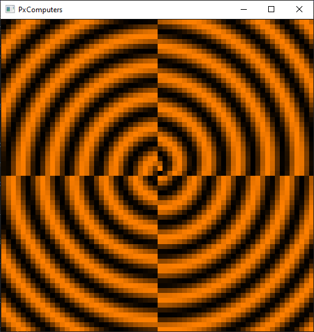

# px-computers
Virtual computer emulator with MMIO devices (OpenGL displays, I/O peripherals, and CPUs running "px assembly").


## how to build and run

```
cmake CMakeLists.txt -B out/build/            - use cmake to generate build files
cmake --build out/build/                      - use cmake to create binary executable
cp -r shaders/ out/build/bin/Debug/           - copy shaders/ to same directory as binary
out/build/bin/Debug/px-computers.exe          - run the executable
```



# px-mainboard

The main part of each computer system is the `px-mainboard`, it acts as the motherboard or host controller for all attached devices.

The mainboard manages a few different components:
```
cpus            - Executes an instruction each tick or cycle.
devices         - Manages attached devices by automatically mapping them into the 16-bit address space.
clock           - Controls the tick rate.
reset_vector    - Memory address to start execution after a reset.
irq_buffer      - Small buffer to keep track of incoming IRQs before they can be sent to the CPU.
main_display    - A pointer to the main display... (Used for OpenGL rendering...)
```
Everything else should be managed by the devices themselves, or in the devices memory.


# px-interface
All devices share a common simple interface that consists of two functions, *readByte* and *writeByte*. All communication between devices indirectly goes through a `px-mainboard` which keeps track of any attached devices, and their mapped memory locations, any bytes sent to the entire 16 bit address space of a mainboard will automatically route it to the correct device.

### readByte(address);

```
mainboard->readByte(0x1800);                  - read a byte at adress 0x1800
```                                           
### writeByte(address, value);                    
                                              
```                                           
mainboard->writeByte(0x1800, 0xFF);           - write a byte at adress 0x1800
```

# px-cpu

### registers and zero page

The first 255 bytes of the CPU's address space are reserved. This memory is used for the CPUs "registers" or any variables/constants that need to be stored in memory.


### addressing modes

```
imm16 0b000
imm8  0b001
dir16 0b010
dir8  0b011
ind16 0b100
ind8  0b101
```

### stack

The `px-cpu` uses a stack-based approach by keeping track of a `SP` register.
After the result of a stack operation the `SP` register will be adjusted, and the appropriate value used.

### stack modes

```
.     0b000 - none
>     0b001 - stack in
<     0b010 - stack out (high byte / carry)
<>    0b011 - stack peek
^     0b100 - stack out (low byte)
^>    0b101 - stack in / stack out (low byte)
```

# px-assembly

See thee [px-assembly](docs/README-assembly.md) readme file.


# px-devices

All `px-device`s share the common `px-interface`.
